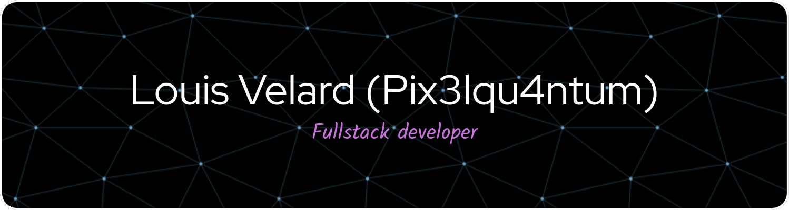

## 🧠 What I Do

* **Backend Development**: Building scalable and efficient server-side applications.
* **Web Development**: Crafting dynamic web applications with modern frameworks.
* **System Design**: Architecting robust and maintainable systems.

---

## 🔧 Technologies & Tools
* **Languages**: 
  
  
  
  

   Go (Golang), JavaScript, TypeScript
* **Frameworks**: React, Express.js, NextJS, Vite, Gin
* **Databases**: PostgreSQL, Mysql, Sqlite
* **Tools**: Docker, Git, CI/CD pipelines

---

## 📈 GitHub Stats

---

## 📣 Let's Connect

* [LinkedIn](https://www.linkedin.com/in/louis-velard/)
* [Twitter](https://twitter.com/Pix3lqu4ntum)
